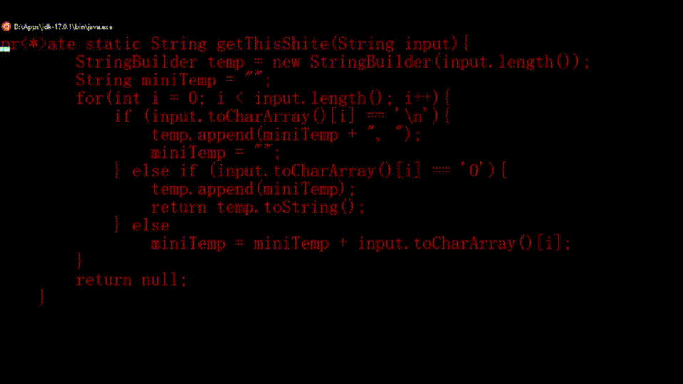

# LinuxShell Java IDE

___
LinuxShell Java IDE is an open source project that focuses on creating an interactive Java-based IDE for java
developers, that are not using a desktop environment. For example, if you wanted to program in Java but your pc is too
slow for Ubuntu Desktop, so you install Ubuntu Server and this IDE to run on it.

## How to install:

You need the jdk 17 one directory above this one \
Either download a release and run it or compile via compile.sh

### Update:

---Renderer seems very complete.

